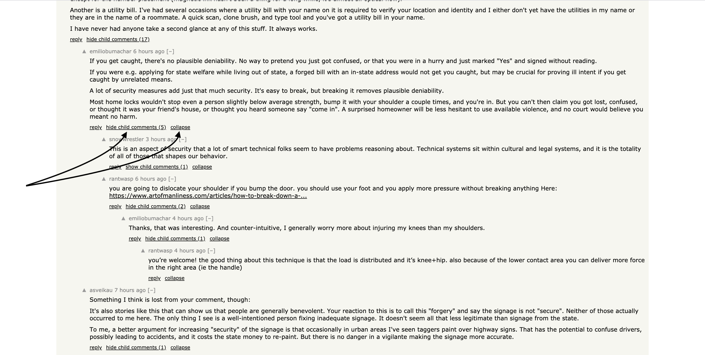
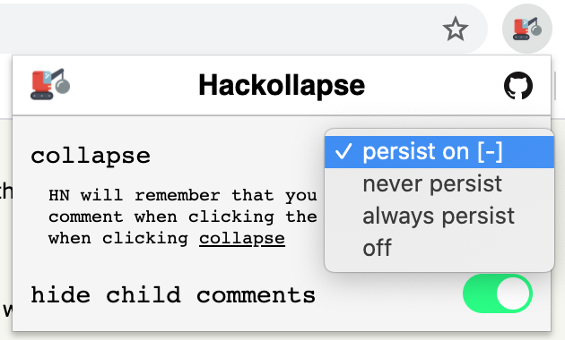

# Hackollapse 

A better way to collapse comment threads on Hacker News!

Features:
- collapse entire comment threads from anywhere in the tree
- quickly see how many children a comment has
- hide/show child comments while keeping the parent comment expanded
- customize whether Hacker News remembers that you collapsed a comment

### Settings ###
Easily toggle the visibility and behavior of the actions

Change how the `collapse` action works:
- `persist on [-]`: HN will remember that you collapsed a comment when clicking the `[-]` icon, but not when clicking `collapse`
- `never persist`: HN will never remember that you collapsed a comment when clicking `[-]` or `collapse`
- `always persist`: HN will always remember that you collapsed a comment when clicking `[-]` and `collapse`
- `off`: turns off and hides the `collapse` action

`hide child comments`: Toggles the visibility of this action
- *Note*: HN will not remember that you collapsed/expanded a thread when clicking this action

### Browser Compatibility ###
Available as a browser extension on Chrome & Firefox

##### Acknowledgements #####
Inspired by Reddit Enhancement Suite and Apollo. Icon made by <a href="https://smashicons.com/" title="Smashicons" target="_blank">Smashicons</a>
